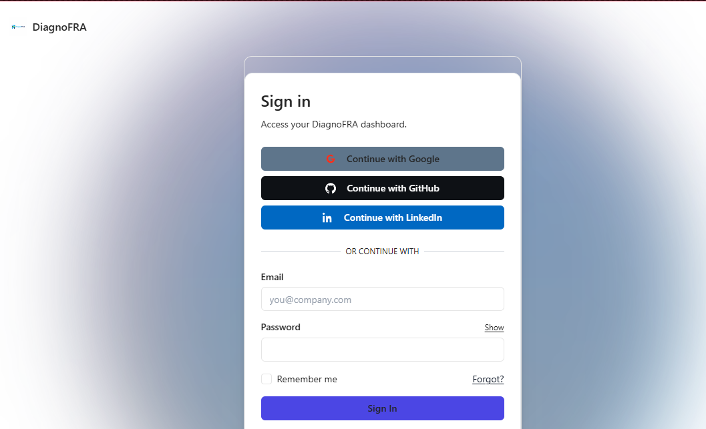
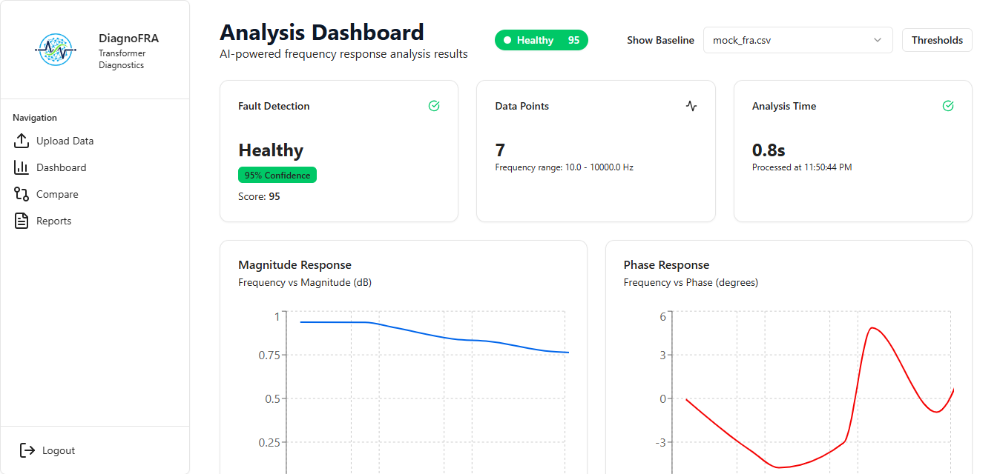
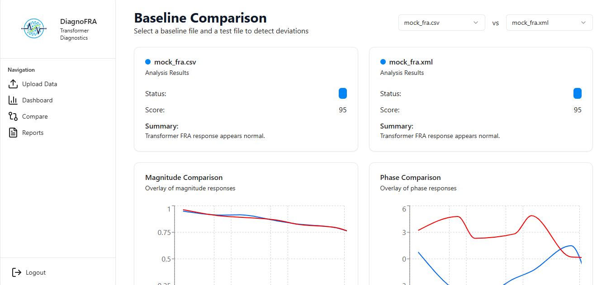

# ⚡ DiagnoFRA  
> **AI-Powered Transformer Diagnostics through Frequency Response Analysis (FRA)**  
Monitor, diagnose, and optimize transformer health with **real-time anomaly detection, explainable AI insights, and interactive dashboards**.  

---

## 🏷️ Badges  
  
  
  
  
  

---

## 🚀 Why DiagnoFRA?  

Power transformers are the backbone of electrical grids.  
Yet, failures are often **unpredictable, costly, and catastrophic**.  

⚠️ **Problems with existing methods:**  
- ❌ Traditional FRA is hard to interpret manually  
- ❌ No real-time anomaly detection  
- ❌ Lack of explainable diagnostics for engineers  

✨ **DiagnoFRA solves this.**  
- ✅ Combines **Frequency Response Analysis (FRA)** with **AI/ML**  
- ✅ Offers **real-time monitoring** of magnitude & phase response  
- ✅ Provides **explainable diagnostics** with confidence scores  
- ✅ Enables **baseline vs. measured comparisons**  

---

## ✨ Features  

- 📊 **Real-time Health Monitoring** → Track FRA curves in magnitude and phase  
- 🔎 **Root-cause Diagnostics** → Pinpoint axial/radial deformations, insulation issues, core grounding faults  
- ⚠️ **Anomaly Detection** → Detect drifts & failures before they escalate  
- 🖥️ **Interactive Dashboards** → Zoomable FRA plots with AI overlays  
- 📑 **Explainable Reports** → Fault localization, recommendations, and confidence levels  
- 🔄 **Baseline Comparisons** → Overlay reference vs. measured responses  

---

## 🖼️ Screenshots  

### 🔐 Authentication  
  

### 📊 FRA Dashboard  
  

### 🔎 AI-Powered Analysis  
  

---

## ⚙️ Tech Stack  

- ⚡ **Next.js 13+ (App Router)** → Modern React framework  
- 🎨 **TailwindCSS + Shadcn/UI** → Interactive & responsive UI  
- 📊 **Recharts** → FRA curve plotting (magnitude & phase)  
- 🎞️ **Framer Motion** → Animations & smooth transitions  
- 🔒 **TypeScript** → Strong type safety  
- 📈 **Vercel Analytics** → Performance monitoring  

---

## 📥 Installation  

```bash
# Clone the repo
git clone https://github.com/Soheb04-git/DiagnoFRA.git

# Move into project
cd DiagonoFRA

# Install dependencies
npm install

# Run dev server
npm run dev
```
<br>
Your app will be live at 👉 http://localhost:3000
<br>
---


## 🧩 Usage  
# 🔐 Login with demo credentials: 

- **Email**: demo@fra.com  
- **Password**: fra123  

# 📤 Upload FRA Data 
- **Supported**: .csv and .xml (frequency, magnitude, phase).  

# 📊 Analyze Diagnostics
- Interactive plots for Magnitude & Phase responses  
- AI-generated results with confidence scores & recommendations  

# 🔄 Compare with Baseline
- Overlay measured vs. baseline data  
- Detect subtle deviations  
<br>
---


## 📖 How it Works  
1️⃣ **Connect** – Upload FRA data from transformer test files.  
2️⃣ **Run Diagnostics** – AI extracts features, computes fault likelihood, and analyzes signals.  
3️⃣ **Act with Confidence** – Engineers get actionable reports with explainable results.  
<br>
---


## 🌍 Deployment  <br>
Easily deploy using Vercel:  

```bash
vercel
```
<br>
---


## 📌 Roadmap  
- Multi-transformer fleet monitoring  
- Predictive maintenance scheduling  
- Cloud + Edge deployment options  
- Advanced ML models (LSTM/Transformers for FRA time series)  
<br>
---


## 🤝 Contributing  
We welcome contributions!  
- Fork the repo  
- Create a branch (`feature/amazing-idea`)  
- Submit a PR 🚀  

<br>
---


## 🧠 Inspiration  
DiagnoFRA is built to bring trust, reliability, and explainability to transformer diagnostics, enabling power engineers to make better, faster, and safer decisions.  
